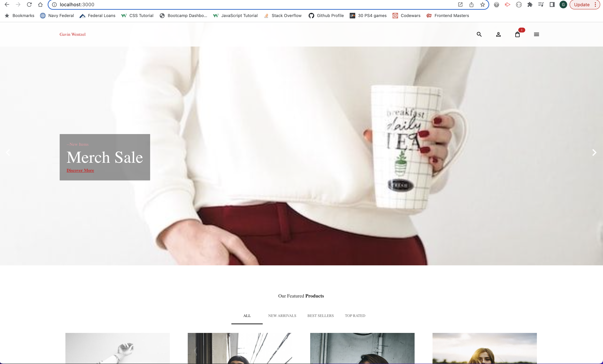

# **E-commerce Music Merchandise Store**
  
## **Description (Motivation? The why? Solved Problems?)**
      
  An electronic marketplace application that will be able to sell music merchandise, artwork, and cd's/vinyl
      
## **Table of Contents** 
      
  - [Usage](#usage)
  - [License](#license)
  - [Contributions](#contributions)
  - [Tools](#tools)
  - [Questions](#questions)
  -[Links](#links)
      
## **Installation **
  
  
      
## **Usage ** 
  md
  
  
  
  
  
         
      
      
## **License **
  Apache 2.0
      
## **How to Contribute **
      
  
      
## **Tools **
      React js, Strapi Backend, Material UI, Stripe, Formik
  
      
## **Questions **
      
  Please feel free to reach me at gavinwentzel@gmail.com or view my github profile at "https://github.com/gwentzel26", 
  my username is gwentz26

## **Links **
  Walkthrough Video or Deployed Application: ""
  Github Repository: ""
